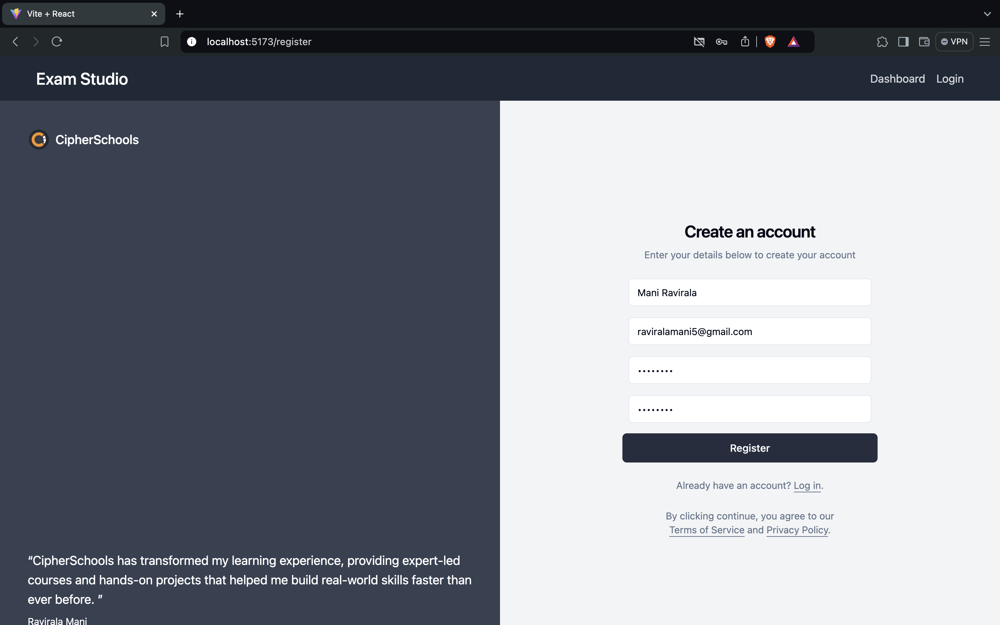
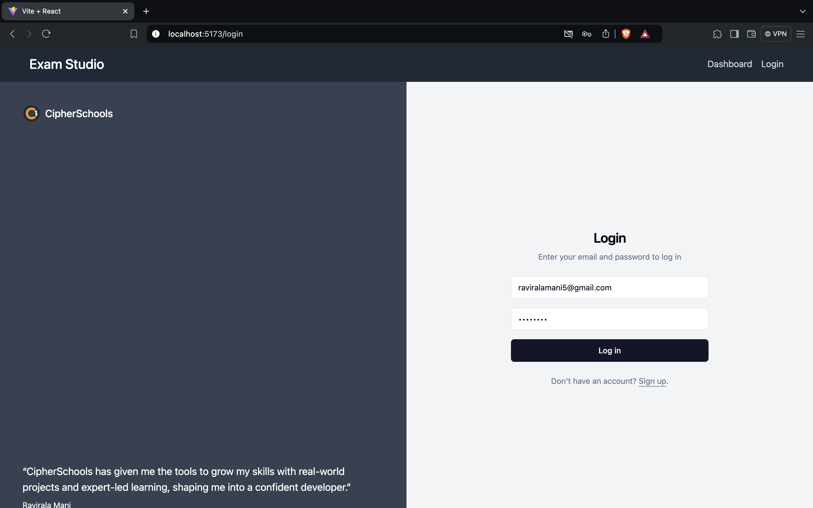
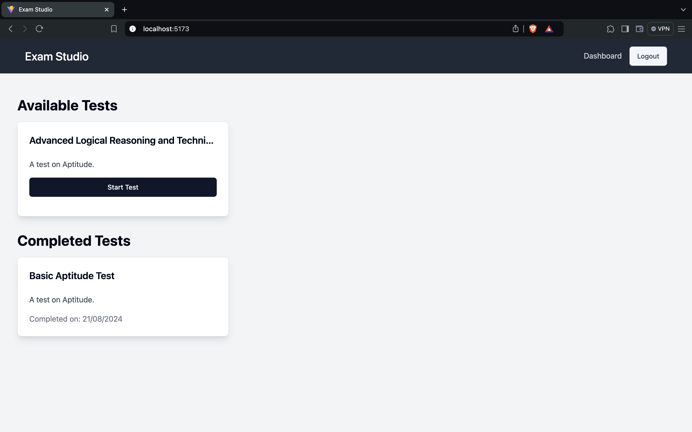
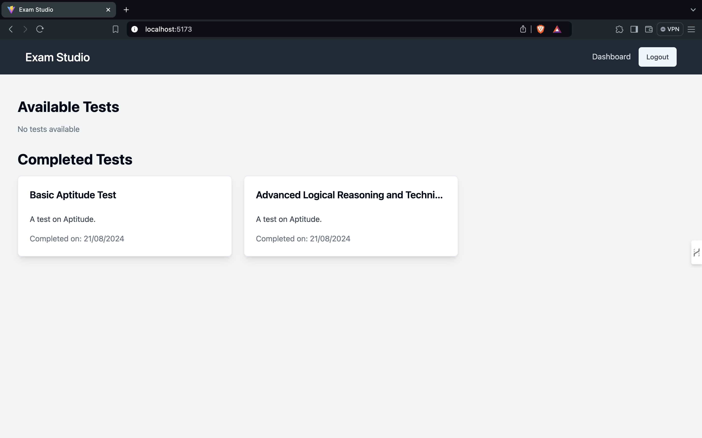
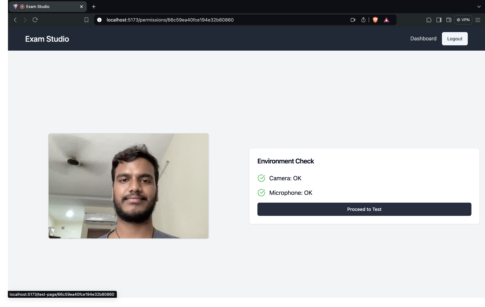
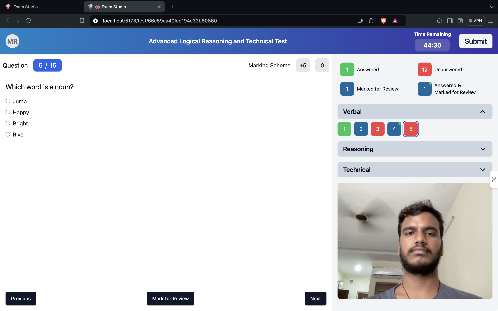
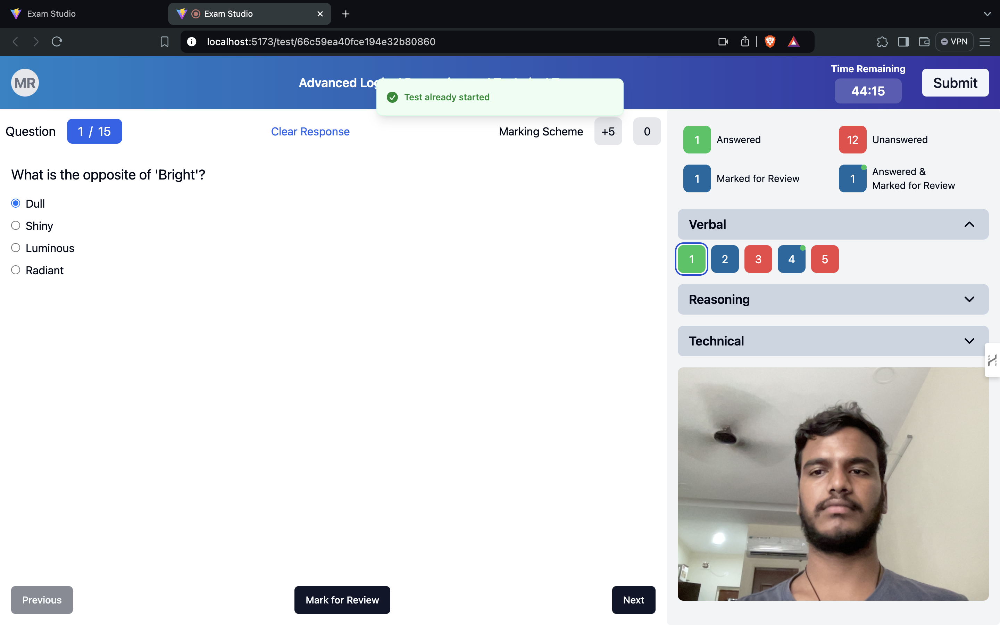
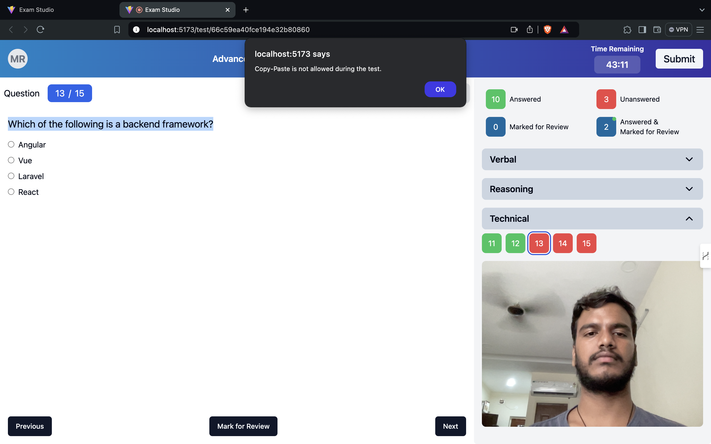
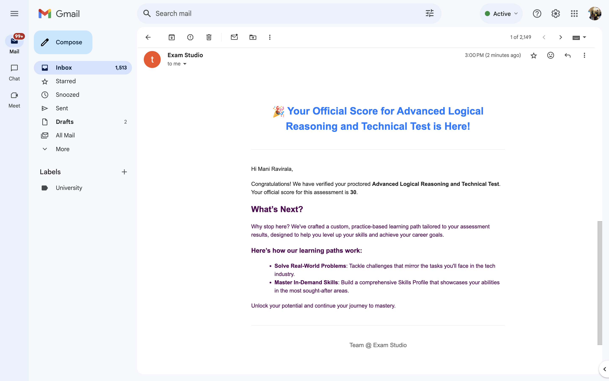

# Exam Studio

## Overview

**Exam Studio** is a secure platform for creating and taking MCQ tests. It offers a modern, intuitive test-taking experience with robust security features. 🛡️📚

## User Account for Testing

Explore the platform with these credentials:
- **Email**: raviralamani5@gmail.com
- **Password**: Exam@123
- **Link**: [EXAMSTUDIO](https://examstudio.vercel.app)

🔒 **Note**: Results won't be shared. Sign up to receive them. We don’t store passwords.

## Key Security Features

- **Secure Test Environment**: Opens in a separate window with disabled browser extensions. 🖥️

- **Copy-Paste & Context Menu Disabled**: Prevents tampering. 🚫✂️

- **Context-Based Authentication**: Ensures secure access to all routes. 🔐

- **Eco-Friendly MCQ Interface**: Intuitive and easy to navigate. 🌿🧩

- **Persistent Timer**: Tracks test duration across page reloads. ⏱️

- **Automated Evaluation**: Tests are evaluated every hour and results are sent to students. 📈📧


## What I Have Done and Learned

- **Test Creation**: Added features for creating and managing MCQs. ✏️

- **User Authentication**: Implemented secure login with cookies. 🍪

- **CORS Configuration**: Set up for multiple origins. 🌐

- **Email Notifications**: Custom email service for test scores. 📬

- **Test Evaluation**: Automated grading with cron jobs. 🕒

- **Route Protection**: Secured with authentication middleware. 🔒

- **Token Management**: Used JWT for user authentication. 🎟️

- **Database Integration**: Connected to MongoDB. 💾

- **Error Handling**: Implemented custom error management. ⚠️

- **Dynamic Routing**: For test data and user info. 🔄

- **Test Timer**: Persistent across page reloads. ⏲️

- **Environment Configuration**: Managed for both backend and frontend. ⚙️


## Features

- **Test Creation**: Manage MCQ sections. 📝
- **User Authentication**: Secure login with cookies. 🔑
- **Test Taking**: Real-time feedback and navigation. 🚀
- **Timer**: Tracks duration persistently. ⏳
- **Email Notifications**: Automated test scores and feedback. 📩

## Tech Stack

- **Frontend**: React, Tailwind CSS, Shadcn UI 🌟
- **Backend**: Node.js, Express.js, MongoDB 🔧
- **Authentication**: JWT, Cookies 🍪🔐
- **Email Service**: NodeMailer 📧

## Setup and Configuration

### Backend

1. Clone the repo:
    ```bash
    git clone https://github.com/maniravirala/CipherSchools.git
    cd CipherSchools/Backend
    ```

2. Install dependencies:
    ```bash
    npm install
    ```

3. Create a `.env` file:
    ```plaintext
    JWT_SECRET=your_jwt_secret_here
    JWT_EXPIRES_IN=10
    CLIENT_URL=http://localhost:5173
    PORT=8000
    MONGO_URI=your_mongo_uri_here
    EMAIL_USER=your_email_user_here
    EMAIL_PASS=your_email_pass_here
    ```

4. Start the server:
    ```bash
    npm start
    ```

### Frontend

1. Navigate to the frontend directory:
    ```bash
    cd CipherSchools/Frontend
    ```

2. Install dependencies:
    ```bash
    npm install
    ```

3. Create a `.env` file:
    ```plaintext
    VITE_API_URL=http://localhost:8000/api
    ```

4. Start the development server:
    ```bash
    npm run dev
    ```

## Screenshots

- **Register Page**: 

- **Login Page**: 

- **Dashboard**: 

    

- **Permissions Page**: 

- **Test Taking Interface**: 

- **On Reload**: 

- **Restriction**: 

- **Email Notification**: 

## Template

```javascript
function scoreTemplate({ name, score, testName }) {
    return `
  <!DOCTYPE html>
  <html lang="en">

  <head>
  <title>Test Score Notification</title>
  <style>
    body {
      font-family: Arial, sans-serif;
      background-color: #f4f4f4;
      color: #333;
      line-height: 1.6;
      margin: 0;
      padding: 0;
    }

    .container {
      max-width: 600px;
      margin: 20px auto;
      padding: 20px;
      background-color: #fff;
      border-radius: 8px;
      box-shadow: 0 0 10px rgba(0, 0, 0, 0.1);
    }

    .header {
      text-align: center;
      padding: 20px 0;
      border-bottom: 1px solid #eee;
    }

    h1 {
      color: #007bff;
      font-size: 24px;
    }

    p {
      margin: 16px 0;
    }

    .content {
      padding: 20px 0;
    }

    .button {
      display: inline-block;
      padding: 10px 20px;
      margin-top: 20px;
      background-color: #007bff;
      color: #fff;
      text-decoration: none;
      border-radius: 5px;
      font-size: 16px;
    }

    .footer {
      text-align: center;
      padding: 20px 0;
      border-top: 1px solid #eee;
      font-size: 14px;
      color: #666;
    }
  </style>
</head>

<body>
  <div class="container">
    <div class="header">
      <h1>🎉 Your Official Score for ${testName} is Here!</h1>
    </div>
    <div class="content">
      <p>Hi ${name},</p>
      <p>Congratulations! We have verified your proctored <strong>${testName}</strong>. Your official score for this assessment is <strong>${score}</strong>.</p>
      <h2>What’s Next?</h2>
      <p>Why stop here? We've crafted a custom, practice-based learning path tailored to your assessment results, designed to help you level up your skills and achieve your career goals.</p>
      <h3>Here’s how our learning paths work:</h3>
      <ul>
        <li><strong>Solve Real-World Problems</strong>: Tackle challenges that mirror the tasks you'll face in the tech industry.</li>
        <li><strong>Master In-Demand Skills</strong>: Build a comprehensive Skills Profile that showcases your abilities in the most sought-after areas.</li>
      </ul>
      <p>Unlock your potential and continue your journey to mastery.</p>
    </div>
    <div class="footer">
      <p>Team @ Exam Studio</p>
    </div>
  </div>
</body>

</html>
  `;
}

module.exports = scoreTemplate;
```

## Acknowledgements

- **React**: For the UI. ⚛️
- **Tailwind CSS**: For styling. 🌐
- **Shadcn UI**: For UI components. 🏗️
- **Express.js**: For backend services. 🚀
- **MongoDB**: For database. 📊

## License

Licensed under MIT. See [LICENSE](LICENSE) for details. 📝
